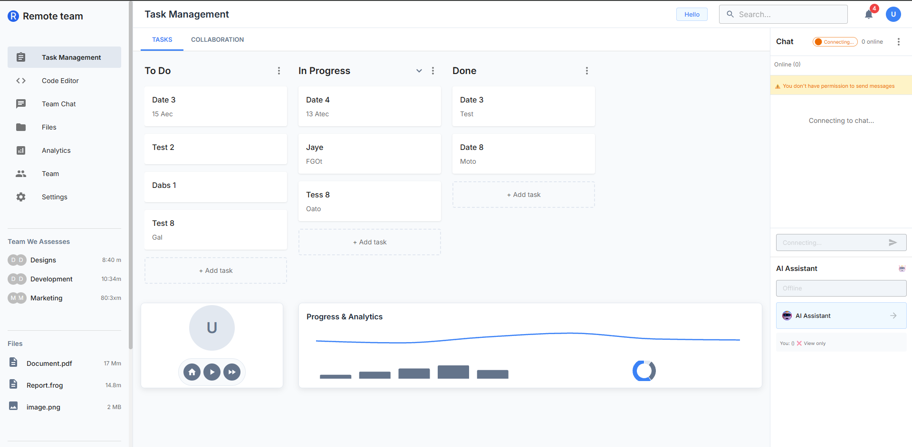
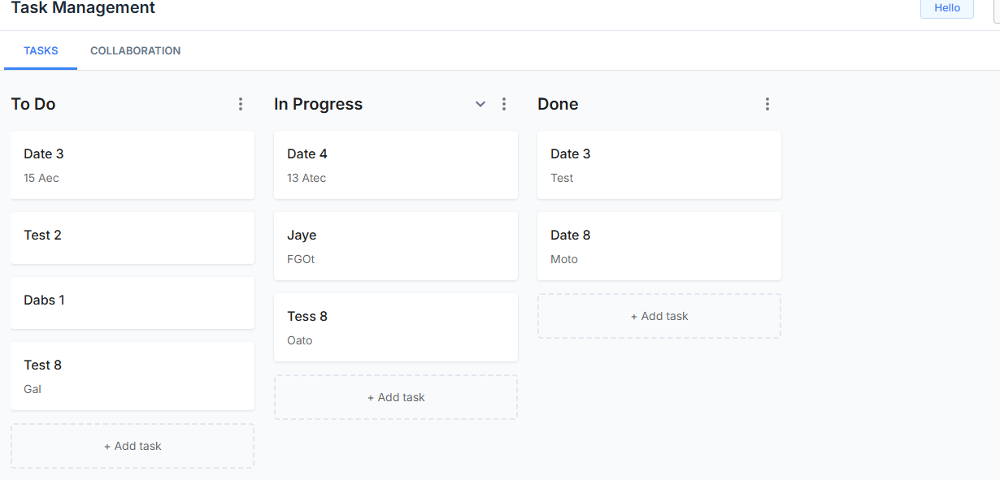
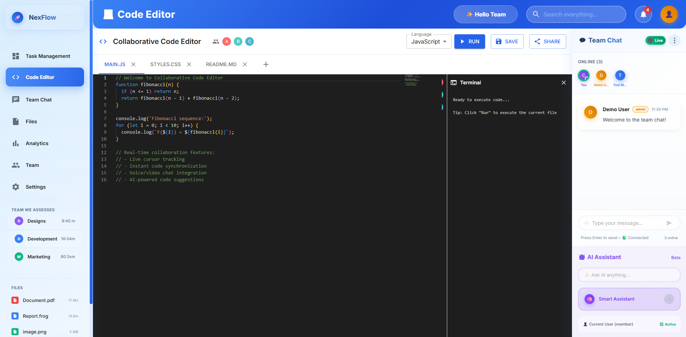
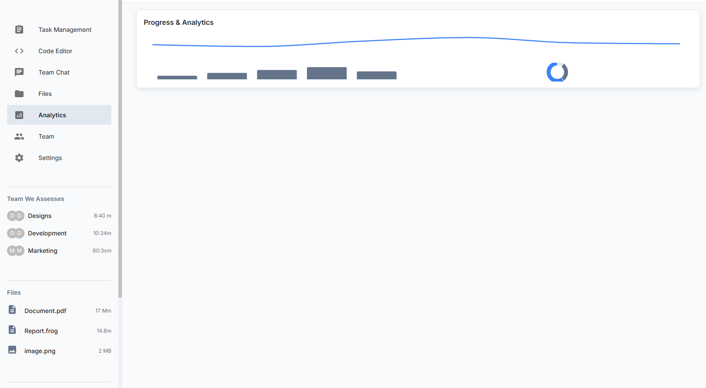

# 🚀 Remote Team Collaboration Dashboard

> 🌟 A modern, full-stack platform for **real-time team collaboration**, featuring live code editing, chat, task management, video calls, and AI assistance. Built for distributed teams who need to collaborate efficiently on projects.

---

## 📋 Table of Contents

- [✨ Features](#-features)
- [🛠️ Tech Stack](#️-tech-stack)
- [📸 Screenshots](#-screenshots)
- [⚡ Quick Start](#-quick-start)
- [🔧 Installation](#-installation)
- [🎯 Usage](#-usage)
- [📚 API Documentation](#-api-documentation)
- [👨‍💻 Development](#-development)
- [🤝 Contributing](#-contributing)
- [📄 License](#-license)
- [📧 Contact](#-contact)

---

## ✨ Features

### 👥 **Team & Workspace Management**
- 🏢 Create unlimited workspaces for different projects
- 👑 Role-based access control (Admin, Member, Viewer, Code-Contributor)
- 🎟️ Invite team members with unique workspace codes
- 📊 Member activity tracking and analytics

### 📋 **Real-Time Task Management**
- 📌 Interactive Kanban board with drag-and-drop functionality
- ⚡ Live task updates across all team members
- 🎯 Task assignment, priority levels, and due dates
- 📈 Progress tracking with visual analytics
- 🔗 Task dependencies and sub-tasks

### 💻 **Collaborative Code Editor**
- 🎨 VS Code Monaco Editor integration
- 👥 Real-time multi-user editing with live cursors
- 🌈 Syntax highlighting for 50+ programming languages
- 🧠 IntelliSense and auto-completion
- 📝 Version control with commit history
- ▶️ Code execution in sandboxed environments (JS, Python, Java, C++)

### 💬 **Instant Team Communication**
- 💭 Real-time chat with threading and replies
- 🔔 @mentions and notifications
- 📎 File sharing in conversations
- 🤖 AI assistant integration for code help
- ⌨️ Typing indicators and online status

### 📁 **Smart File Management**
- 📤 Drag-and-drop file uploads
- 📋 Version history and file tracking
- 🏷️ File tagging and organization
- 🔐 Granular access permissions
- 🔍 Advanced search and filtering

### 📊 **Analytics Dashboard**
- 📈 Interactive charts and graphs
- 📉 Team productivity metrics
- ⏱️ Time tracking and reporting
- 🎯 Project completion rates
- 👤 Individual contributor insights

### 🎥 **Video Call Integration**
- 📹 Built-in video conferencing
- 🎤 Screen sharing capabilities
- 🔊 Voice calls with crystal clear audio
- 💻 Code review sessions with video overlay

### 🤖 **AI-Powered Assistant**
- 💡 Smart code suggestions and completions
- 🐛 Automatic bug detection and fixes
- 📖 Code documentation generation
- 🔍 Intelligent search across codebase
- 💬 Natural language queries for help

### 🌐 **Advanced Features**
- 🔌 GitHub/GitLab integration ready
- 📱 Responsive design for all devices
- 🌙 Offline mode with automatic sync
- 🔒 Enterprise-grade security
- 🚀 Real-time notifications across devices

---

## 🛠️ Tech Stack

### **Frontend**
- ⚛️ **React 18** with TypeScript
- 🎨 **Material-UI** for modern components
- 📊 **Recharts** for data visualization
- 💻 **Monaco Editor** (VS Code engine)
- 🔄 **Socket.io Client** for real-time updates
- 📱 **React DnD** for drag-and-drop

### **Backend**
- 🟢 **Node.js** with Express.js
- 🍃 **MongoDB** with Mongoose ODM
- ⚡ **Socket.io** for real-time communication
- 🔐 **JWT** authentication
- 📁 **Multer** for file uploads
- 🤖 **OpenAI API** integration
- 🛡️ **Helmet** & **CORS** for security

### **DevOps & Tools**
- 🐳 **Docker** containerization ready
- 🔧 **Nodemon** for development
- 🌍 **Environment-based** configuration
- 📝 **ESLint & Prettier** for code quality

---

## 📸 Screenshots

🖼️ View Application Screenshots

### Dashboard Overview

### Task Management Board

### Code Editor

### Analytics

---

## ⚡ Quick Start

### Prerequisites
- 📦 Node.js 16+ installed
- 🍃 MongoDB running locally or cloud connection
- 🔑 OpenAI API key (optional, for AI features)

### 🚀 Get Started in 2 Minutes

